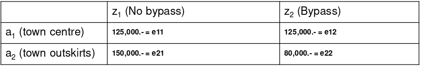
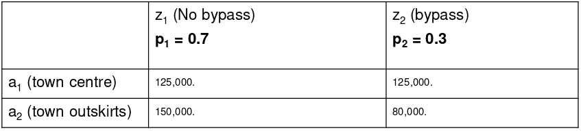
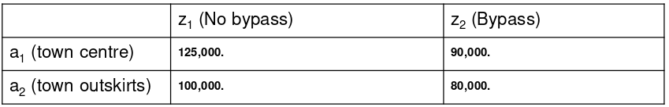
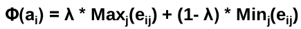
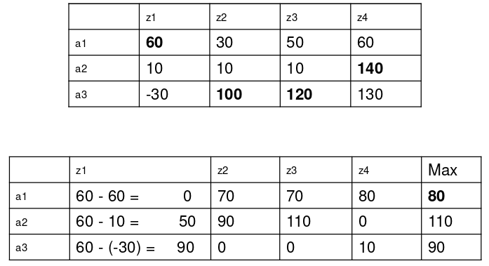
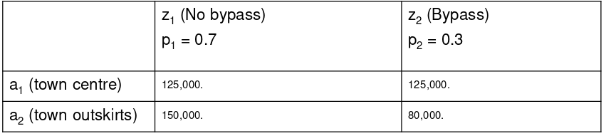
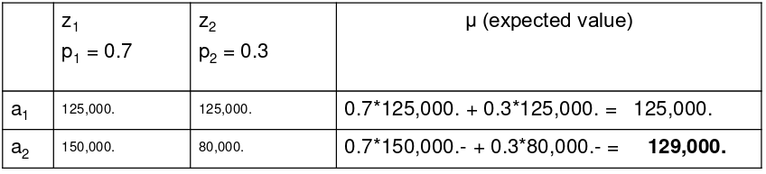
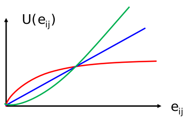
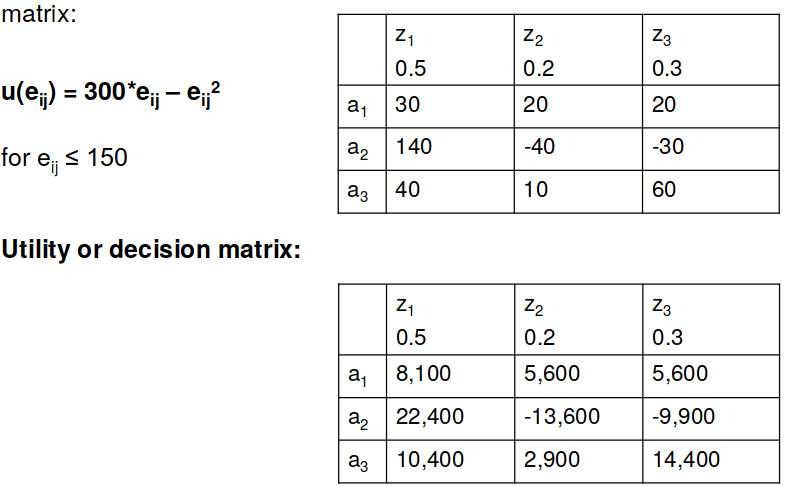

# Normative Decision Theory
The __normative decision theory is more rational__. E.g. if you want to a maximum of profit and you have the options to open a store with 125,000 CHF profit and another store with 150,000 CHF profit, you decide for the second one __on a rational basis__.

The __main subject__ of the normative decision theory is not conflicting target but rather __uncertainty__ (ger: Ungewissheit). 

## Result / Decision Matrix
The mineral oil company is aware that a large-scale bypass is planned but that this is highly controversial. 
- It wouldn't affect the traffic in the town centre and the expected profit would remain at CHF 125,000.
- However, there would be a drastic change to the outskirts of town which would bring the expected profit down to CHF 80,000.

__Rresults matrix:__ The form of depiction for decisions involving uncertainty, where the alternativ actions (ai) are depicted in the rows and the different environmental conditions in the columns (zi). 

The decision matrix only describes the decision situation if the state space is recorded in full. So if there are changes on the environment in future, you can not involve that in your decision.

## Decision with probabilities
__Decision involving risk:__ If occurrence likelihoods can be assigned to environmental conditions. 
__Decision involving uncertainty:__ If no occurrence likelihoods can be assigned to environmental conditions. 

*Probabilitis must not only be mathematically or statistically sound (objective probabilities), but rather may also only result from the subjective view of the decision maker (subjective probabilities).*

## Dominance
An alternative is described as __dominant__ if it is to be preferred over another alternativ in all cases. If an alternative dominates all others, it must be preferred on rational grounds. 

__Absolute dominance__: If the worst result value of the dominating alternative is better than the best result value of the dominating alternative. 

__Circumstantial dominance__: One alternative in every circumstance (environmental circumstance) is better than (or equally good as) the other alternative.

*In this figure, there is no absolute dominance, because a1 is not better in every situation than the best of a2. There is no circumstantial dominance, because a1 is better, regardless of the environmental conditions.*

__Target dominance__:  If a target is considered to be a decisiv one, the fulfilment of all other targets can be put aside.

### Different Target 
- __Complementary targets__: By pursuing one target, the other target is also (optimally) achieved. 
- __Neutral targets__: Don't influence each other. 
- __Competing targets__: Realising one target impacts on reaching the other target.

## Lexiocographical order
In lexiocographical order you put priorities to some criterias (e.g. first priority = Sales, second priority = Environmental damage). All options will be sorted according to the priorities (primary key and secondary key) and the one on the top wins.

## Utility function (Nutzwertanalyse)
Weigthns the different parameters (e.g. the factor for profit is higher than for revenue). Afterwards the variant with the biggest utility is the one to be choosen.

## Decission rules

### Maximin rule
The alternative action with the maximum minimum is chosen.

__Intention:__ Decision rule with an extreme level of risk aversion, as only the poorest possible result is reflected in the evaluation.  
__Criticism:__ Not in touch with reality and only one single value of an alternative is taken into consideration.

### Maximax rule
The alternative action with the maximum maximum is chosen.

__Intention:__ Extremely venturesome (optimistic) decision rule, as only the best possible result is reflected in the evaluation.
__Criticism:__ Extremely out of touch with reality and equally only one single value of an alternative is taken into consideration.

### Hurwicz rule
Combination of the maximin and maximax by the introduction of an optimisation parameter lambda (0 <= lambda <= 1).

In optimistic decission making lambda should be choosen high, otherwise it should be low.

__Intention:__ Decision rule for decision makers who are neither absolutely optimistic nor absolutely pessimistic.
__Criticism:__ In many cases out of touch with reality and only two values of each alternative are taken into consideration.

### Savage-Niehans rule
Rule of the lowest regret. 

The rule attempts to minimise the maximum possible regret. Create a 
regret matrix matrix in which the maxima determine the environmental conditions and then the maximum possible difference for this value is calculated per course of cation. The maximum possible regret is then the row maximum.

You do following for each column: Take the maximum value and calculate the possible lost value for each cell. The row (alternative) with the minimum possible lost value (the minimum regret) wins.

__Criticism:__ With regard to the regret matrix, the decision is based on the principles of the minimax criterion. For this reason, not all information is used even in the case of this criterion and a pessimistic sentiment is ultimately expressed. A particular point of criticism relates to the circumstance that the ranking between two alternatives can change after the addition of another alternative.

### Laplace criterion
The average of all environmental conditions is formed for every alternative. The winner is the alternative with the highest average over all conditions. 

__Criticism:__ 
It  can be said that probably most people would have chosen the alternative a 3, and thus comparing the Laplace criterion with the other rules is more realistic.

## Logical procedure
Subjective probabilities for environmental conditions are formed and the decision situation is converted in this way to a decision involving risk. 

### mu criterion/Bayes rule

__Expected value:__ The expected value is the value which results as a mean if the situation were to be endlessly repeated.

__risk aversion:__ The decision maker prefers a lower expected value if this provides more security.  
__risk neutral:__ The decision maker is indifferent to the fluctuation of results, he only orientates himself on the expected value.  
__venturesome:__ The decision maker avoids a higher expected value in favour of a wide range of varying results.

## Decission Tree
A decision tree always consists of one root node and any number of inner nodes as well as at least two leaf nodes. Each node represents a logical rule and each leaf node an answer to the decision problem.

    Decisions are drawn in square fields. Events are drawn in circles. You can also note the probability of the alternative to the related leaf or the path.

## Bernoulli Principle
The basic idea is to calculate the expected value not from the results values but rather from the utility values and to then regard these as preferential values.  
E.g. if you get a million CHF, you can do a lot of things! But if you earn another million (=2 MIO), you can not do the double of these things. 

The Bernoulli survey can be used to determine the utility function, which
results in a risk-utility function (RNF) or a utility function. The blue is risk neutral, the green is risky, the red is risk averse. 

Procedure

If the risk utility function is given, a utility or decission marix can be formed.

If a risk utility function is given there's only __one rational decission__.

