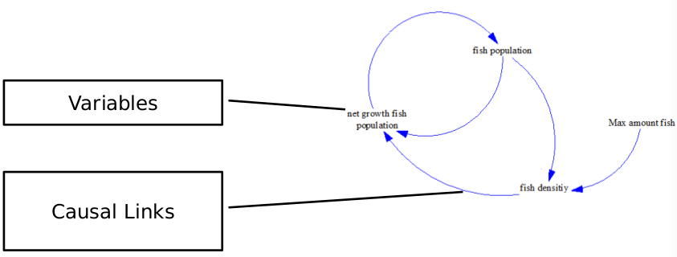
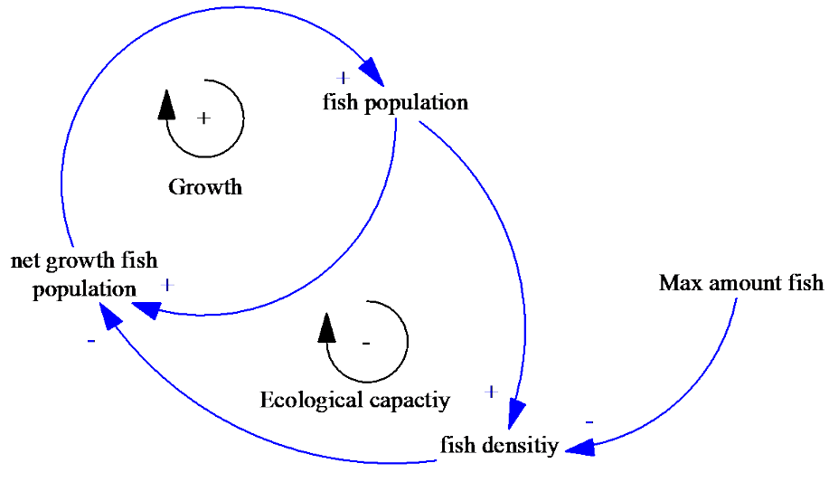

# System Thinking and System Dynamics

## Causal Loop Diagram
The following picture shows a casual model of a fish population in a limited biosphere.

### Definitions
__Positive polarity:__  
Increases (decreases) cause, then increases (decreases) effect.

__Negative polarity:__   
Increases (decreases) cause, then decreases (increases) effect.

__Reinforcing Loop:__  
The reinforcement increases the initial effect. A loop is reinforced when the number of minuses is even. e.g. if I put additional fishes into the population.

__Balancing Loop:__  
The feedback balances the initial effect. A loop is balanced if the number of minuses are odd.

The following picture shows a casual loop diagram.

