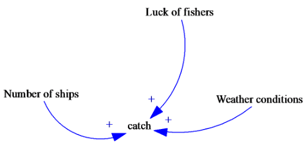
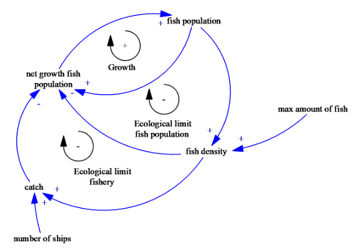
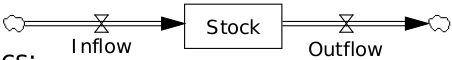
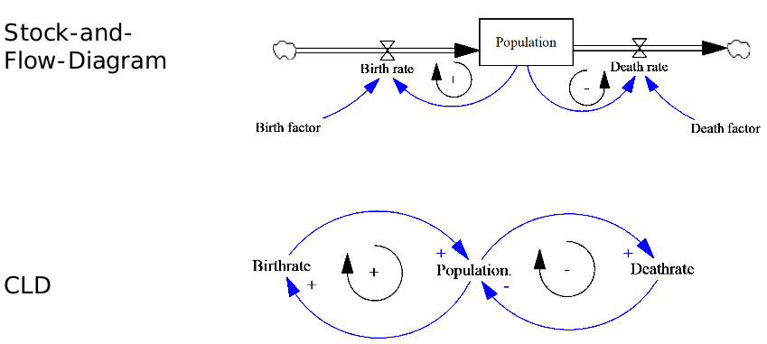

# Basic Concepts

## Linear Thinking

## Feedback Thinking

We derive the essential dynamics from the mechanisms within the system boundaries.

With feedback the catch will decrease due to multiple boats because the sea is getting outfished (but I have no idea, I'm from Switzerland). In linear think such a behaviour would not be possible.

### Goals
__Understanding, not forecasting__  
The goal of a system dynamics policy study is understanding the interactions in a complex system that are conspiring to create a problem, and understanding the structure and dynamic implications of policy changes intended to improve the system’s behaviour (Richardson 1991: 164)  
__Modeling for learning__  
Therefore, the primary goal is not to build the model of the system, but rather to get a group engaged in building a system dynamics model of a problem in order to see to what extent this process might be helpful to increase problem understanding and to devise courses of action to which team members feel committed (Vennix 1996: 3, emphasised in the original)’.

# Accumulation
*Understanding accumulation is fundamental to understanding system behaviour.*

The development of an entity of time is defined by the hydraulic metaphor, and the equivalent mathematical equation, below.

With the stock-and-Flow-Diagram, you show the inflow, the outflow and the current stock. 

*A stock takes time to change, because flows take time to flow. That’s a vital point, a key to understanding why systems behave as they do.*

Stocks:
- are state values, the “memory” of a system
- Need an initial value
- Only change via In-and Outflows
- Value does not change ↔ Inflow= Outflow
- Value increases ↔ Inflow> Outflow
- Value decreases ↔ Inflow< Outflow
- have units such as liter, CHF, meter

## Difference Between Casual Loop Diagram and Stock-and-Flow Diagram

### CLD Benefits
- Create an overview and understand a complex system
- Uncover leverage points
- Reduce the complexitiy in finding potential side-effects and feedback from policy interventions
- Identify dependent variables & potentially conflicting goals
- Improve quality of discussion by precise presentation of the subject of matter.

### Rules for good CLDs
- Variable name : Rule 1-3
- Causal relations: Rule 4 - 9
- Loops: Rule 10 - 11
- Model: Rule 12