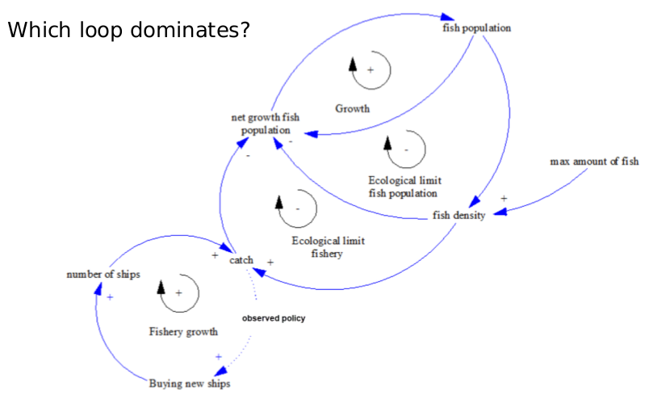
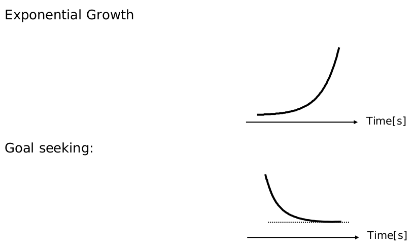
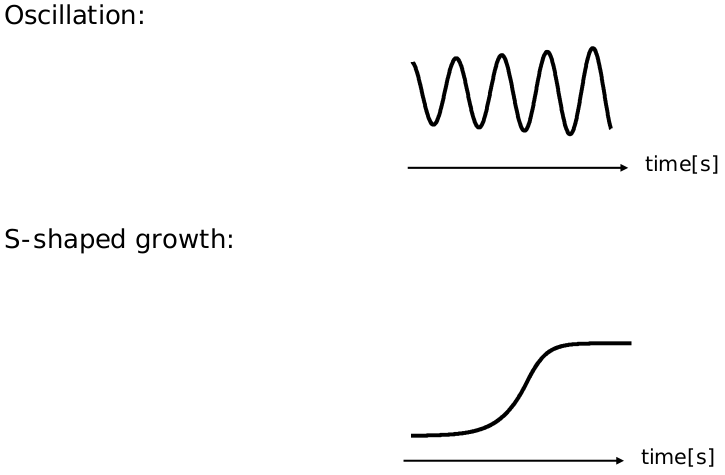
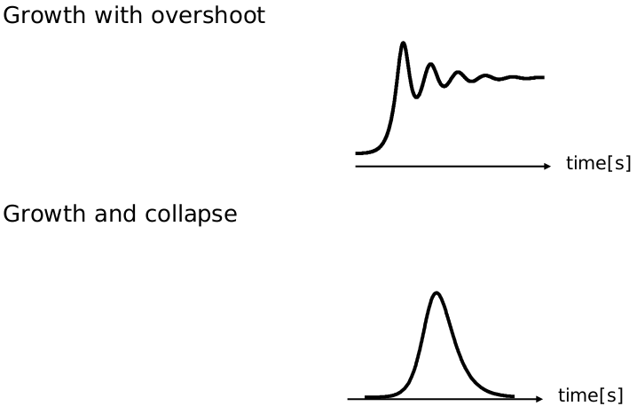
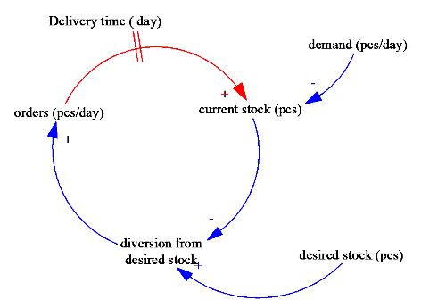

# Limits of casual loop diagrams

## 1. Domination

With CLDs only and no simulation model, it is not possible to determine which loop dominates.

## 2. Collapse point of a system

Saturation points are not modelled. Like when are enough fish in the sea.

## 3. Loop interaction

On basis of the CLD it is not possible to figure out, how the loops will interact. The importance of the loops are not modelled.

# Fundamental modes of dynamic behavior

## The matter of time
