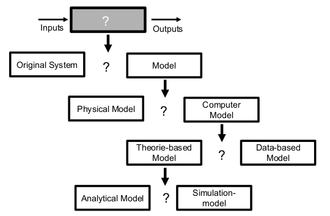
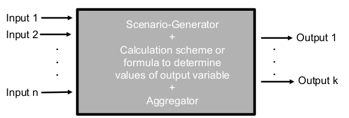

# Simulation

## Simulation = Modeling

It's not possible to simulate something without a model.

Definition Modeling:  
Deriving calculation schemes (models) where the output variables can predicted sufficiently accurately from the input variables.

### Finding a model

One way is to play with the real system to find out how it works and reacts. If this is possible and the possible damage is low, it might be a good idea. If the damage is big, it is better to recreate a physical model (e.g. a big pool to simulate a lake.)

## Different simulation paradigms

### Monte Carlo Simulation

MC Simulation is a broad class of algorithms that rely on repeated sampling to obtain numerical results.

### System Dynamics

SD is an approach for understanding the behavior of
complex systems over time, using stocks, flows, feedback loops, and time delays.

### Discrete Event Simulation

Simulation, where system state only changes at discrete points in time. Key element: Queue.

### Multi-agend Simulation

In MA Simulation, we have a system that consists of
multiple entities with identical or different behavior. They solve problems collectively.

# Monte Carlo Simulation

MC Simulation is a numerical method for statistical simulation. It is based on using sequences of random numbers in order to explore the behavior of the system. Monte-Carlo simulation also provides an alternative for solving complex problems in probability and statistics.

## Monte Carlo Model

1. The Scenario-Generator creates scenarios according to a prescribed probability distributions that match reality.
1. Each scenario yields values of the target variable that can be obtained via a calculation scheme or formula.
1. The Aggregator calculates the output(s) form the target values associated with each simulated scenario.

# Discrete Event Simulation

A Simulation-model is a virtual representation of a real-world system that allows to gain insights in how the system works in reality.

## Queuing System

In a queuing system, __jobs__ are processed by a __server__. Under the (realistic) assumption that the server has a particular limited capacity (e.g. specified as the maximum number of jobs that can processed per hour), the system can get congested and waiting times may occur.

## Advantages

- Cost-effective, fast, and safe field of experimentation (compared to experimenting with original system)
- Allows animation and hence increases system understanding
- Allows the analysis of complex systems at a high level of detail (compared to analytical solutions)

## Disadvantages

- Requires significant (software) development time
- Construction of a simulation model is relatively prone to error
- Sound interpretation of results is challenging