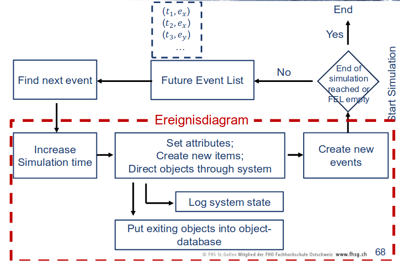
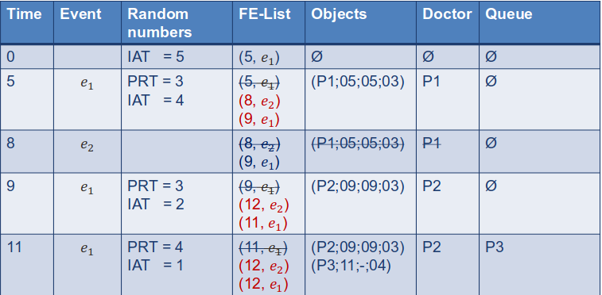
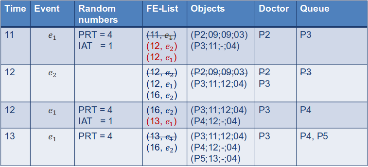
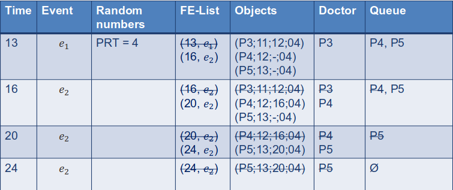

# DES Simulation

## DE Mechanics

* PRT = Process Time (Zeit wie lange die Behndlung/Prozess dauert)
* IAT = Inter arrival time (Zeit bis nächster Event eintrift)
* FE-List = Time of next event
* Objects = Current Working state
* Queue = Waiting list

## Stochastic processes

When modeling processes random variables are often use to define PRTs and IATs or any other value.

### Random variables

These properties must be set for each random variable:

- Distribution type
    - Theoretical distribution (Uniform, Exponential, Normal)
    - Empirical distribution (Sampling from historical data)
- Estimating parameter values in selected probability distribution

Different theoretical distributions can be found within the presentation (p. 83-84).

### Theoretical distributions

__Advantages__
- Compact formulations (usually 1 or 2 parameters)
- Easy to adjust (via small number of parameters)
- Wide range of returned random numbers

__Disadvantages__
- Limited number of prameters for adjusting the distribution in the desired direction.

### Empirical distribution

An empirical distribution represents the same probability for value X as in real historical data.

__Advantages__
- Based on real data
- Any shape is possible

__Disadvantages__
- No numbers can be generated which is not part of the historical data
- Cannot be described in a compact manner
- High memory footprint
