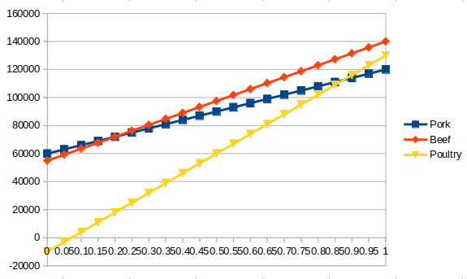

# Choice under uncertainty

__a)__ 
| |Customers want Pork | Customers want Beef | Customers want Poultry
|-|---|---|---
| Beef | 55'000 EUR | 140'000 EUR | 55'000 EUR 
| Pork | 120'000 EUR | 70'0000 EUR | 60'000 EUR
| Poultry | -10'000 EUR | 40'000 EUR | 130'000 EUR

__b)__

If he's __optimistic__ he'd go for beef production. If he's __pessimistic__, he'd choose the pork production.

__c)__  
Beef: 83'000 EUR  
Pork: 83'000 EUR  
Poultry: 53'000 EUR

He'd choose either __beef__ or __pork__.

__d)__  
| |Customers want Pork | Customers want Beef | Customers want Poultry
|-|---|---|---
| Beef | 65'000 EUR | 0 EUR | 75'000 EUR 
| Pork | 0 EUR | 70'0000 EUR | 70'000 EUR
| Poultry | 130'000 EUR | 100'000 EUR | 0 EUR

He should produce __pork__.

__e)__  
